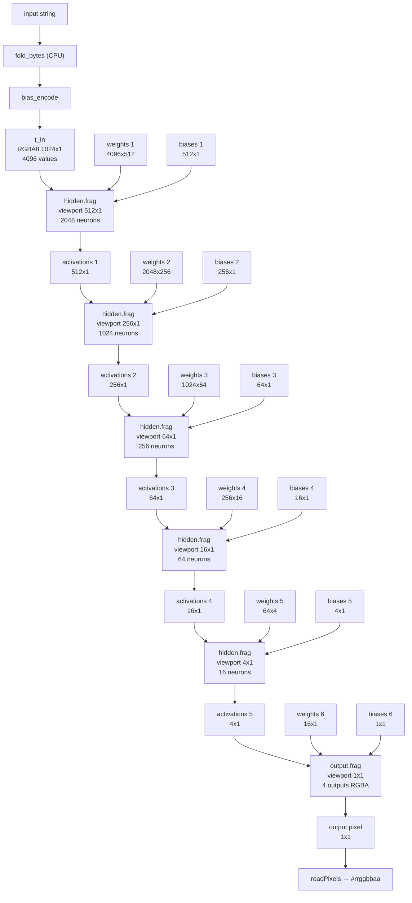

# [pixel.ai](https://chetgdp.github.io/pixel.ai)
Make a single pixel generator AI model, anything in -> one pixel out

A pixel is made up of 3 or 4 u8 values: 
- RGB/RGBA (Red, Green, Blue, Alpha)
- HSV/HSL (Hue, Saturation, Value/Lightness)
- CMYK (Cyan, Magenta, Yellow, blacK)

For our purposes we can do RGBA, it is quite simple to perform conversions anyway. So we have our output, one pixel, 4 bytes, thats a u32

Anything in means we should accept an array of bytes as input: [u8]

text? ascii, utf8, utf16, easy. images? video? documents? simple, just read the bytes

How big of an input should we accept? a few mb? No, larger, say 4gb? or essentially whatever the static maximum is. 

This can be a very simple neural network. You have 4 output nodes and many many more input nodes. 

## 

we have a nice base now simple random init of weights and a forward pass, no training, no backprop, etc

we hardcode the seed, so each init should be the same. 

now to be a crazy person, we build a wasm-bindgen project and try to make this a webiste. for now simple

textbox -> output display under it

next, we get to be a crazy person. using webgl2/glsl shaders to run forward pass

### ML

The sigmoid function we were using was giving us either 0 or 255 values. So we had claude come up with an activation function derivative of the sigmoid for 8 bit integers. It's basically an s-curve.

```
plot ((x * 127 / (abs(x) + 4096)) + 127) * 255 / 254 for x from -20000 to 20000
```

how to do backprop in wasm live? live signal like or dislike

then we can do training

### three.js

camera:
- need panning
- fix wasd affecting camera
- smoother zoom
- fix center to not be the final pixel for better rotating

- add spinner for loading
- final 4 pixels are RGBA, should show the components
- add generic framerate info thing

viz:
- not sure i like the three circles per layer
- how to make viz update in real time as it goes (can we? its too fast, you would have to slow it down)

## run

```
cargo build

cargo run -- "text"

cargo run -- inputfile.any

feh --zoom max --force-aliasing pixel.ppm 

wasm-pack build --target no-modules --out-dir pkg_nomodules

histos config.yaml -o pixel.ai.html
```

## histos

TODO: update histos llms.txt to document script injection order. user `scripts` are inlined *before* `core.js` in the output HTML, so `window.wasmReady` and `wasm_bindgen` don't exist yet when user scripts execute. user scripts must defer to `DOMContentLoaded` then `await window.wasmReady`:

```js
window.addEventListener('DOMContentLoaded', async () => {
    await window.wasmReady;
    const { MyThing } = wasm_bindgen;
    // ...
});
```

## WebGL2 Forward Pass Pipeline


